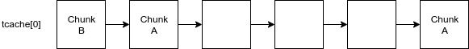

Introduction
============

Themed after Tolkien's work, DwarrowdELF gets its name both as a pun on the executable format
and as an insight on what awaits you if you embark on this journey. "A Journey in The Dark":
how can you solve a pwn without having the binary? 
Not unlike the exploration of Moria, we find our way though the darkness by using the service
to shine light unto the code, one basic block at a time.

I usually avoid blind pwn tasks, since they tend to involve a lot of guessing. However, this is NOT a blind pwn task,
since the interaction with the server intends to reveal the binary code by design.

The task is split into two parts: Exploration (Coding) and Conquest (Memory Corruption). As stated, initially,
the binary is not provided. The only resource is a text file containing a table of function names and corresponding
GOT and PLT addresses and an IP and port where the service is running.

The interaction is structured as a maze game: the player moves through chambers, choosing between 3 directions (left, right, back).
Some of them contain stairs that lead to a lower level and the player may be prompted to descend multiple times per chamber.
Each chamber has an associated hex string. Those familiar with x86_64 reversing should identify it as hex-encoded machine code pretty quickly.

Looking deeper, chambers are revealed as basic blocks and directions (left, right) correspond to conditional branches: left means 
"branch not taken" and right is "branch taken". Chambers with a single exit are unconditional branches. Function calls are
represented as prompts to descend stairs, while the return from functions is coded as ascending stairs.

Approaching the problem
=======================

The problem translates into a traversal of the CFG with the goal of recovering the code. To make the task more challenging:

* the code is position-independent (PIE)
* the offsets between blocks for conditional and unconditional branches are not provided
* basic blocks are not labeled in any way such that the player cannot ascertain the current position within the graph
* jump targets are not necessarily the start of a basic block; sometimes they lead to the middle of another block - a feature
	often encountered in loops

The first step towards solving the task is to map the entire graph using traversal algorithms, such as DFS. Since
the graph is cyclic and blocks are not labeled, we must develop heuristics to figure out when two different nodes (meaning,
reached by different inputs) represent the same block. 

The heuristics we used:  
* if a node has two successors and one's code is included in the other, remove the duplicate part
* if a node has a successor identical to itself, merge them
* if two nodes have identical code and the same (or identical) successors, merge them
* if a node has two predecessors such that one's code is included in the other, remove the duplicate part
* if two sink nodes (outdegree 0) exist such that one includes the other, remove the duplicate part

These heuristics are not always sound, since the binary contains code reuse to the extent of multiple-basic-block structures.
In these cases, a wider context must be analyzed.
Another thing to take into account is that this traversal needs to start multiple connections to the service. For the first level (corresponding
to the main function) the binary exits upon return. The connection also has a timeout of 300 seconds.

You can find diagrams of these heuristics [here](img/).

Once we recover the graph and display it as a graph (using dot, for example), it should look readable, as in IDA's Graph View, right? :)  
Or not...  
All references to global variables, including library calls, are relative and that means we can't resolve them without knowing
the address of each basic block. Moreover, not knowing the offsets between blocks, we can't even tell whether two calls from different
blocks target the same function. We must attempt to piece together the blocks.

Assembling the puzzle
=====================

As a starting point, we know if a block ends in an unconditional branch, the "jump not taken" successor is adjacent. We can split the
function into contiguous pieces by starting from a block and always following the "left" edge.
Each piece can be represented as an interval: [starting\_address, end\_address). 
We formulate our puzzle as a satisfiability problem. As variables we have the starting addresses of each piece. We place the following constraints:

1. The interval fits within the function: 0 < piece\_size[i] + piece[i] < function size
2. Intervals do not overlap: piece[i] + piece\_size[i] <= piece[j] or piece[j] + piece\_size[j] <= piece[i]
3. Jump offsets fit within the offset size (1-byte or 4-bytes)
4. Jump offsets do not fit into a smaller offset size (1-byte instead of 4)
5. References to the same function must be consistent (relative offsets are correct). We can detect that two functions are the same in the
	case of program (not-library) functions, where we can explore them and see that they have the same code. No two functions are similar
	enough that this should pose a challenge.

By feeding these constraints into z3 we get an ordering of the pieces and reconstruct the function. The reconstructed code is not necessarily
identical with that from the task binary. Indeed, even in the official solution, some blocks are out of place. All that matters is that the
blocks which contain references to global objects/functions are placed correctly. 

(Only one function needs to be reconstructed faithfully: the one involved in the calculation of the key to the Chamber of Mazarbul. Fortunately,
that function is rather small and only has three "pieces". More on that later.)

From now on the code should be loadable into your favourite static analysis tool where you can work it into something readable. Here's where the
gotplt.txt file that we mentioned earlier comes into play. 

To understand the functionality we must match the library calls. The code is position independent and we don't know the relative offset of
the call sites from the PLT. Since we reconstructed entire functions, we can compute the offsets of the call targets from each other (for example,
we are able to tell if two calls target the same function, or a function and its successor in the PLT). If we are able to match a single call
to a function from the PLT we can infer all the others. We achieve this by looking at their parameters.

A good function to start from would be one that takes a variable number of arguments; this will be one of _snprintf_, _fprintf_ or _\_\_isoc99\_scanf_,
per gotplt.txt. Another way to approach this would be noticing a particularity in the code of a certain error handler that is called in main
(listed as _error\_oom_ in the table below).
The first block of the function contains in its middle a sequence of instructions resembling a function's prologue:  
```assembly
55                      push   rbp
48 89 e5                mov    rbp,rsp
48 8b 05 9e 3e 20 00    mov    rax,QWORD PTR [rip+0x203e9e]
48 8b 00                mov    rax,QWORD PTR [rax]
48 89 c1                mov    rcx,rax
ba 0f 00 00 00          mov    edx,0xf
be 01 00 00 00          mov    esi,0x1
48 8d 3d ee 37 20 00    lea    rdi,[rip+0x2037ee]
e8 92 fb ff ff          call   0xfffffffffffffbb9
bf 02 00 00 00          mov    edi,0x2
e8 78 fb ff ff          call   0xfffffffffffffba9
55                      push   rbp
48 89 e5                mov    rbp,rsp
48 81 ec 50 01 00 00    sub    rsp,0x150

```

These instructions come after a call instruction. We can infer from this that the traversal passes from _error\_oom_ to another function because the former
does not end in a return instruction - this was optimised out, the function ending in an exit call. By matching the call with exit, we found our Rosetta
Stone and can match all calls to the proper PLT functions.

A high-level overview of the solution:

1. Recover the CFG
2. Piece back the blocks for individual functions
3. Fix references to global variables and functions
4. Reverse the code, calculating the key for the Chamber of Mazarbul
5. Enter the Chamber of Mazarbul, leading to the archive containing the first flag and the resources required for the second part
6. Analyze the downloaded binary (or continue with the reconstructed code, if you prefer), discover the vulnerabilities
7. Pwn => spawn a shell => grab the second flag

In the next section we detail the implementation of the binary.

Functionality
=============

The following table lists the most relevant functions by the names used in this writeup, the directions that lead the traversal to the start of the
function and a short description of their functionality:

| Name                  | Directions        | Description                                                                                                                                                        |
|-----------------------|-------------------|--------------------------------------------------------------------------------------------------------------------------------------------------------------------|
| main                  |                   | performs initializations and starts the exploration by calling traverse                                                                                            |
| traverse              | <ny               | handles the logic of the traversal                                                                                                                                 |
| handle_call           | <ny>>><<>><<><>y  | handles user interaction when encountering call instructions                                                                                                       |
| retrieve_block_cmpval | <ny>>><<<<<>><n>y | indentifies the number of switch cases as part of the switch handling logic; this function is of particular interest because its exploration is handled separately |
| error_oom             | ><y               | handler for failures to allocate memory                                                                                                                            |
| error_cfi             | <nnn<y            | called when call stack integrity checks fail                                                                                                                       |

The binary is a self-disassembler. It uses libcapstone, more specifically _cs_disam_iter_, to disassemble a function one instruction at a time.
The traversal is performed in a recursive function that we will refer to as:  
```c
	void traverse(const void *target_func)
```
It is called from main (depth 0). After disassembling an instruction it handles several cases:

* conditional branches (belongs to the X86_GRP_JUMP group and does not belong to X86_GRP_CALL or X86_GRP_RET)
* unconditional branches (id is X86_INS_JMP)
* switches (indirect jumps - operand type is a register)
* indirect, RIP-relative branches (operand type is memory)
* call (belongs to X86_GRP_CALL)
* return (belongs to X86_GRP_RET)

Entering a function triggers a recursive call of traverse and pushes a context to a global stack of call contexts. Upon return, a sort of
CFI is enforced, validating that the context extracted from the stack corresponds to the targeted function. Library calls are overlooked (they
trigger no exploration prompt).

In addition to the call context structure, the code involves another structure: a block context. The structures look thus:

```c
struct block_hist_t {
    const void* ea;
    size_t size;
    const void* last_insn;
};

struct call_hist_t {
    const void *ea;
    int bl_hist_n;
    int bl_hist_top;
    struct block_hist_t* bl_hist[396];
};
```

The call context is a global, static array of _call_hist_t_ with size 10. Block context structures (_block_hist_t_) are allocated dynamically.
In both cases, the buffers are implemented as ring buffers.

The function that handles calls and the functions that handle switches are of particular interest. When we explore the _traverse_ function
and try to enter a particular function you will encounter the following prompt:

	To reach the Chamber of Mazarbul you must be aware of your surroundings
    and mind your step. Prove it by recounting what you see:

What's the deal with this?  
Reversing the call handler (which we will call _handle_call_) clears this up: when the call target is 
a particular function (_retrieve_block_cmpval_), a key is computed based on _handle_call_'s content. 
The functions involved in the computation of the key are explorable, since they are in _handle_call_'s sub-graph, not _retrieve_block_cmpval_'s.  
The key is computed as follows:

1. _handle_call_ is disassembled using _libcapstone_ and all the mnemonics are concatenated, ordered by the instruction's address
2. the resulting buffer is used as key for the initialization of an RC4 context
3. a 16-byte plaintext, hardcoded on the stack, is encrypted using this context

To compute the key, we must reconstruct _handle_call_. This proves relatively easy, since it is composed of only 3 "puzzle pieces". The order
can be even brute-forced without employing our z3 solver.

Once the key is provided, the Chamber of Mazarbul opens and an URL is printed. This leads to a directory containing an encrypted archive and
decryption instructions. The archive itself contains the flag to "DwarrowdELF - Exploration" and the resources for the second part:
the binary itself and libraries (libc.so.6, libcapstone.so.4).

Why provide the binary after all the work spent to recover it, you may ask. The main reason is that solving the pwn part without being able to 
debug the exploit would be improbable and inhumane. Although the reconstruction of a runnable ELF that mimics the
original one is possible, after QA-ing this task we decided that it would be too time consuming to fit into the duration of the CTF.

Vulnerability Analysis
======================

Bug1
----

First off, there is a trivial not-really-bug that may help with the reconstruction. The error handler invoked when a context popped from the 
call stack does not match (_error_cfi_) actually prints to stdout, not stderr.

If we could trigger this by corrupting the call stack we could find the offset between the original function address and the overwritten one.  
This can be achieved with the vulnerability 3). It may not prove that useful, though, since if someone got to this point they probably reversed 
the binary pretty thoroughly. (Or, maybe, this can be triggered through fuzzing)

Bug2
----

To understand this vulnerability we must look into how switches are handled.  
On x86_64, switches typically work like this:
* the index is checked against the case count
* the index is used to perform a lookup into a jump table; the value found there is added to the address of the jump table
* the result is stored into a register and the block ends in a jump to that register

In traverse, switches are treated when encountering branches where the target is a register. First, the number of cases is determined in a separate function.
This function is, in fact, the _retrieve_block_cmpval_ we talked about earlier: the function that can only be explored by entering a key. It operates on the previous
block, assuming that is the block with the comparison against the case count. The function's logic is this:

* disassembles the block's last instruction and computes a mask based on the branch condition
* iterates through the block's instructions, trying to find the last instruction which matches the mask
	(meaning that the instruction sets flags that are checked by the conditional branch)
* if this instruction has an immediate operand, this is the case count

After returning to _traverse_, another function is called, this time in order to locate the address of the jump table. The jump table is assumed to be accessed
using a "lea" instruction that addresses RIP-relative memory. Next, the traversal prompt is printed, asking the player to input a number between 0 and case_count - 1.
This is also handled by a function that reads an index in a loop and validates that it is less than the case count.

... And here we find the second bug!  
The comparison is signed, meaning that we can __index negatively__, derailing the traversal and causing undefined behaviour.

Bug3
-----

Next, we must review the implementation of the ring buffers used for storing the call and block history.  
The outer structures, _call_hist_t_, are held in a static buffer of fixed size 10.
This buffer acts as a stack: upon entering a function, the index is incremented and the context is initialized; upon return, the index is decremented and
the last context is validated - checking that the pointer to the function start matches the value it was initialized with. If the number of context exceeds 10, the first
(oldest) context is overwritten. When the counter reaches 0 and a context is popped the stack, it wraps around to -1 % 10 == 9.  
Or, does it...?

```c
0xffffffff % 10 == 5 != 9
```

We now have our answer to how we can capitalize on the first bug:

* explore traverse recursively, creating 14 contexts
* explore our target function, that we want to know the address of; the context will be placed at index 4
* return 5 times, popping the context from the stack; this will trigger the error function, since the context at index 4 does not match traverse. We learn from the
formatted output the address of traverse and the address of the target function and calculate the offset.

Bug4
----

The last bug is similar to the third, but affects the block history buffer instead.  
The implementation of the ring buffer is different: it uses two pointers, for the head and tail. Allocated blocks are in the interval between head and tail. The
allocated part may wrap around, meaning that the tail is at a lower address than the tail.

Because of the same modular arithmetic error, if the tail is before the head, with the tail at 0 and we remove a block, the tail wraps around to 5.
The _block_hist_t_ entry at index 4 is freed; removing another block triggers a __double free__.

The _block_hist_t_ structures are fast chunks of chunk size 0x20. DwarrowdELF is linked against libc 2.27, which uses tcache.
To those unfamiliar with the internals of glibc's ptmalloc allocator - particularly, thread local caching, check out [this article](https://sourceware.org/glibc/wiki/MallocInternals).

The blocks are allocated using malloc (not calloc) exclusively, meaning they are taken from tcache if available. This chunk size is used only for this type of structure.
Our plan is to use the double free to perform a __tcache dup attack__.

Planning the exploit
====================

In order to use bug2, we have to find viable dwords to use as offsets from the jump table. Then we can lead the traversal into GOT, from where we can leak libc addresses,
which will be disassembled and printed as code (runes). If _cs_disasm_iter_ fails, _traverse_ returns, making this step of the exploit non-deterministic because of ASLR.
Leaking an address from either libc or libcapstone is enough, since the offset is constant and we can compute the load addresses of both.

Next, we have to choose a convenient place to trigger bug4. The block history buffer is large, thus we have to find a path within a function with > 400 blocks.
The solution is use a function that contains a loop, preferably one that cycles between 2-3 blocks, in order to have increased control over the state of the buffer.

Another aspect to take into account is that after corrupting the tcache the heap is left in a very unstable state. Returning from a _traverse_ triggers many _free()_ calls.
Another traverse call issues allocations (large chunks for _cs_open_ and _cs_malloc_). Moreover, if any blocks are traversed, they are allocated from the tcache.

The tcache loop obtained though the double free looks like this:  


When chunk A is allocated, the fd is overwritten with the address at the start of the traversed block. Allocating chunk A a second time places this code address at the top of the tcache. 
Any further allocations of this size will result in a crash, since this address is located in a readonly page.  
Therefore, we must be frugal with our allocations. An ideal situation would be to reach the state where we can overwrite chunk A's fd while triggering only two allocation (chunks B and A).

Let's catalogue what's within our control:
* responses to traversal prompts are read one character at a time, so we don't control anything meaningful here
* we control the first qword in some heap chunks (the _block_hist_ts_), being able to write only values that act as addresses in the traversal
* we control a global, static buffer that holds the user input for the key prompt

Our only useful write primitive is the second one. We can use bug2 to misdirect the traversal and thus write almost-arbitrary values (addresses in a writable map) over the first qword
of a heap chunk. To use this vulnerability we must reach the only function that includes a switch (_retrieve_block_cmpval_).

To recap, we have to create a loop in the tcache by overflowing the _block_hist_t_ buffer and using bug4. To this end, we have to lead our traversal through a loop, then go backwards and
then manage to reach the switch in _retrieve_block_cmpval_. This latter function actually contains a loop, so it could be suitable for our exploit.

However, when building the exploit this turned out to be way more complicated that it sounds. Getting a traversal sequence right such that we don't ruin the tcache loop is delicate and
we only have limited control over the allocations. In practice, the loop in _retrieve_block_cmpval_ proved unsuitable. We chose to use another function, _handle_call_, which also has a
loop.

In order to get from _handle_call_ to the switch in _retrieve_block_cmpval_ using only "^" we must corrupt the call history stack a bit using bug3 and place _retrieve_block_cmpval_
before _handle_call_. When returning from _handle_call_ we would reach the switch without triggering the CFI check.

Building the exploit
====================

The plan is this:  
1. use bug2 to leak libs
2. corrupt the call stack with bug3 in order to return from _handle_call_ into _retrieve_block_cmpval_
3. allocate many _block_hist_t_ by traversing a loop and free blocks until obtaining a loop in tcache
4. return from _traverse(handle_call)_ into _traverse(retrieve_block_cmpval)_, go backwards to switch
5. use a negative switch index to direct the traversal in the controlled buffer
6. lead the traversal into GOT
7. traverse exactly 5 blocks in GOT, then return upon _cs_disasm_iter error_; in this process we overwrite chunk A's fd with a GOT address
8. return from GOT into buffer; lead the traversal into a (libc) address that we want to write in the GOT
9. encounter a call in the libc block and enter, triggering the overwritten GOT function

So far, we have explained the logic behind the first four steps. The last part is trickier. Since we control the buffer (that resides in .bss, after the GOT)
with the key input, we will inject some code of our own that will lead the traversal to the right places. The key check uses a memcmp of length 32 and we
will place our code after this.

This can be viewed as some sort of DOP "shellcode":
```assembly
dq target_libc_address
call offset_to_GOT_entry
jmp [rip - 19]
```

The first qword represents a libc address that we want to write over a GOT entry. The call instruction is meant to lead the traversal to said entry, writing
the GOT address over chunk A's fd. This _traverse_ must clear out 5 blocks from the tcache and return (because of a failure to disassemble the next). On return,
the traversal reaches the jmp and continues into the libc block. After reaching the end of a block here, a chunk is allocated over the GOT as a _block_hist_t_
and the block start address (libc address) is written, essentially overwriting a GOT address.

Next we must wait for the GOT function to be triggered, spawning a shell.

This clears out the main ideas behind the exploit, but some details remain to be decided:
* how can we guarantee that the traversal of the GOT clears out exactly 5 blocks?
* what GOT entry to overwrite
* what to overwrite it with

The first issue introduces another source of non-determinism, hinging on the values from the GOT which are randomized by ASLR. 
We solve it by preemptively checking whether the traversal passes through exactly 5 blocks and otherwise abort it.
This would speed up our exploit by removing the overhead of interacting with the remote.

The second and third issue are connected. The overwritten entry must be a function we are able to trigger. The allocation of a chunk having this entry as its
first qword will lead to the corruption of other GOT entries. We must ensure that these will not be triggered before the overwritten one.  
Moreover, the LSB of the original GOT address does not depend on ASLR and it must correspond to a valid opcode that will not ruin our plan to bruteforce
our way to clearing 5 tcache chunks.

Switching the focus to the third issue, we identify some constraints as well. Obviously, it must lead to a shell. We don't control any other buffer, so it's
impossible to place any "/bin/sh" in the argument. We could use the one gadget RCE trick.  
However, looking at the blocks containing the "one gadgets", they all end in jmp. This means that the block will not be recorded into the block history, so
we can't overwrite a GOT address with the block start. We must use a block BEFORE the one gadget. Therefore, once we succeed triggering the overwritten
GOT entry the control flow will pass to this block and the right branch must be taken to reach the execve. This places another constraint on the GOT
entry we choose to overwrite: the state of the registers and the eflags when the function is triggered.

The best option we have found is to overwrite _cs_malloc_ with a block preceding a one gadget that ends in jnz.

The final exploit can be found in [here](https://github.com/psilvia/dwarrowdELF). As the exploit requires some brute force, it must be ran multiple times before succeeding.
