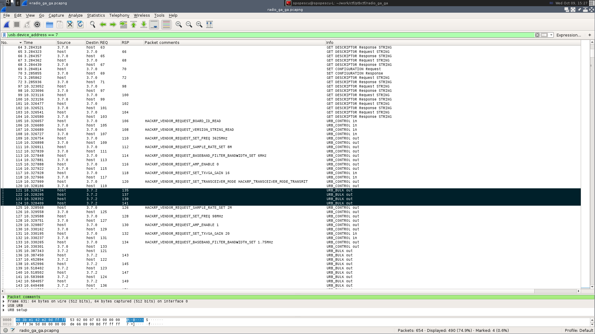
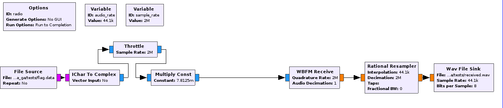

## Context
The task consists of a packet capture of an exchange of USB messages. The endpoints are an everyday laptop and a Software Defined Radio peripheral, namely a HackRF One. What the PCAPNG contains is the laptop emitting FM radio from a WAV file where the the flag is spelled out. The goal of the task is to extract the data that would normally be broadcasted, "receive" the WAV from the FM transmission, and get the flag.

## PCAPNG Analysis
When dealing with any kind of radio communication the first questions that might come to mind are:
1. What is the frequency this thing is talking on?
2. What's the sample rate?

Normally, radio capture tools export the raw I/Q data to a file which has the frequency and the sample rate in the name. And if a tool does not behave like this, it is considered a good practice to rename the file accordingly before passing it on to someone else. But, we have no raw I/Q file, just a PCAPNG with USB traffic. Thankfully, a simple glance at the Descriptor Response packets will quickly identify the peripheral as HackRF One, which is fully open-source. Therefore, we can take a look at the [code](https://github.com/mossmann/hackrf/blob/master/host/libhackrf/src/hackrf.c) handling the USB communication and interpret the control packets in order to gain (pun intended) more insight into the matter. Here follows a screenshot of the relevant control packets, annotated in Wireshark.



You can notice that HackRF initially sets the parameters to some default values and sends some garbage data (marked in black in the picture), before setting the desired sample rate, frequency and gain, as well as transmitting the raw I/Q data pertaining to the signal of interest. The bulk transfers are the signal data.

The raw I/Q data can be extracted with tshark:

```bash
tshark -r radio_ga_ga.pcapng -2 -R "usb.device_address == 7 and usb.transfer_type == 3 and usb.urb_type == 'S'" -T fields -e usb.capdata | tail -n +5 | tr -d ':' | tr -d '\n' | xxd -r -p > flag.data
```

Here we intentionally ignore the first 4 bulk transfers because they are useless. Having obtained the I/Q data, we can now recover the audio.

## From raw I/Q to WAV
The way HackRF works with samples is using interleaved signed bytes, which are quite different from pairs of 32-bit floats that most tools look for when working with signal data. You can look at the source code again for the conversion or searching Google a bit. It is an issue people routinely face when working with files captured using the `hackrf_transfer` utility.
Another aspect to notice is that we don't really need the frequency. Normally, if you were receiving the signal over the air you would have to tune in to the right frequency and use some sort of filter to get a clear version of the signal. However, since we have the samples as they are sent from the laptop to the SDR, over USB, there is no need for the frequency. There is no noise we need to take care of also. All that is needed is the audio rate, which ideally should match the original. The most common options are 44.1kHz and 48kHz. For this challenge, the former was used.
Putting it all together in GNURadio Companion, looks something like this:



## Recovering the flag
Due to a mistake on my behalf, the resulting audio is "squeezed", yielding a very fast talking voice. The original audio was roughly 15s and the one resulting from the above mentioned process is about 3s long.
I didn't think this was such a big issue, since you can import the resulting WAV into something like Audacity and tinker with the Change Speed and Change Pitch effects until something audible is recovered. Internal testing suggested as much also.
However, the teams that attempted the task during the competition complained (rightfully) that somecharacters were hopelessly inaudible. After subjecting the audio to a larger panel of organizers, we agreed that some parts were too hard to interpret considering variability in speakers, headphones, and personal differences between individuals. Since the goal of the challenge was never to demand anything other than technical skills from the players, we changed the accepted flag to a regex of the most understandable parts and teams managed to get the correct answer. I'm not sure it will amount to much, but please accept my sincere apologies for the inconvenience this part has caused you.
Funny enough, a few days later I was talking to our team captain about the possibility of a more robust solution. He came up with an interesting idea. Ar first, one would need to identify the TTS engine used. This is quite easy since, of the ones I tested, only pico TTS was able to produce any audio for "left curly bracket". I haven't been able to test all available TTS engines at that time, but this should serve as an identifiable artifact. Next, since the audio begins with "PTBCTF{", you would use pico to generate something like "P T B C T F { A A". Your goal is to identify the first character after the left curly bracket, but you need another character afterwards since the audio will sound different if the target character is the last one or not. You can then overlap your "prefix audio" with the result WAV stretched to 15s and compare characters in isolation and take into account breaks in the audio between characters. Rinse and repeat and get the flag!
