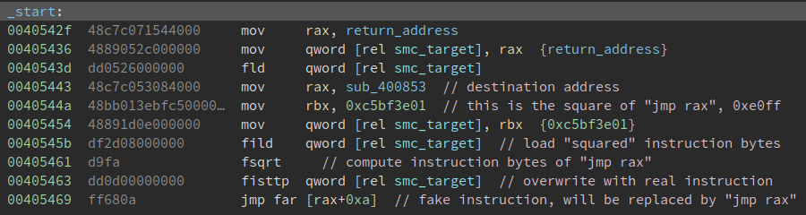

# Unconventional

## Recon

We are greeted by a strange ELF64 file:

```shell
$ file unconventional
unconventional: ELF LSB executable, x86-64, version 1 (SYSV), unknown class 128
```

The class of `0x80` is a common trick to fool disassemblers such as Binary Ninja or IDA. This can easily be fixed by patching the header with the correct value of `0x02`. However, fixing this is the least of our problems.



As noted in the comments, this binary is heavily obfuscated using floating-point instructions and self-modifying code. It uses a combination of `fsqrt`, `fiadd`, `fisub`, `fimul` and `fidiv` with operands scattered across random addresses to compute real/useful instructions and then reverses the operations (in order to prevent easy dumping shenanigans).

Calling and returning are also handled by the FPU stack.

## Deobfuscation

Since not everyone uses the same tools, I will only enumerate the techniques used for those of you brave enough to implement a proper deobfuscator.

### vcall
```c
macro vcall addr {
	local ..tmp
	; save ret
	mov rax, @f                // return address (@@ below)
	mov qword [..tmp], rax
	fld qword [..tmp]          // return address pushed on FPU stack
	mov rax, addr              // call target
	mov rbx, 0xc5bf3e01        // (jmp rax)**2
	mov qword [..tmp], rbx
	fild qword [..tmp]
	fsqrt                      // compute "jmp rax"
	fisttp qword [..tmp]       // overwrite next instruction
	..tmp: dq 0x0a68ff         // "jmp rax"
	@@:
}
```

### vret
```c
macro vret {
	fstp qword [@f]            // writes return address @@
	mov rax, qword [@f]        // loads return address in rax
	mov rbx, 0xc5bf3e01        // (jmp rax)**2
	mov qword [@f], rbx        // computes and stored "jmp rax" @@
	fild qword [@f]
	fsqrt
	fisttp qword [@f]
	@@: dq 0
}
```

### fsqrt
```c
macro dec_run_enc_sqrt addr, len {
	local ..run_target
	fild qword [addr]
	fsqrt
	fisttp qword [..run_target]
	repeat 8-len
		mov byte [..run_target+(8-%)], 0x90
	end repeat
..run_target: dq 0xc001f00d
	repeat 8-len
		mov byte [..run_target+(8-%)], 0x00
	end repeat
	fild qword [..run_target]
	fimul dword [..run_target]
	fisttp qword [..run_target]
}
```

### fiadd imm
```c
macro dec_run_enc_add_imm addr, var, len {
	local ..run_target
	fild qword [..run_target]
	fiadd dword [addr]
	fisttp qword [..run_target]
	repeat 8-len
		mov byte [..run_target+(8-%)], 0x90
	end repeat
..run_target: dq var
	repeat 8-len
		mov byte [..run_target+(8-%)], 0x00
	end repeat
	fild qword [..run_target]
	fisub dword [addr]
	fisttp qword [..run_target]
}
```

### fisub imm
```c
macro dec_run_enc_sub_imm addr, var, len {
	local ..run_target
	fild qword [..run_target]
	fisub dword [addr]
	fisttp qword [..run_target]
	repeat 8-len
		mov byte [..run_target+(8-%)], 0x90
	end repeat
..run_target: dq var
	repeat 8-len
		mov byte [..run_target+(8-%)], 0x00
	end repeat
	fild qword [..run_target]
	fiadd dword [addr]
	fisttp qword [..run_target]
}
```

### fiadd
```c
macro dec_run_enc_add addr1, addr2, len {
	local ..run_target
	fild qword [addr1]
	fiadd dword [addr2]
	fisttp qword [..run_target]
	repeat 8-len
		mov byte [..run_target+(8-%)], 0x90
	end repeat
..run_target: dq 0xc001f00d
	repeat 8-len
		mov byte [..run_target+(8-%)], 0x00
	end repeat
	fild qword [..run_target]
	fisub dword [addr2]
	fisttp qword [..run_target]
}
```

### fisub
```c
macro dec_run_enc_sub addr1, addr2, len {
	local ..run_target
	fild qword [addr1]
	fisub dword [addr2]
	fisttp qword [..run_target]
	repeat 8-len
		mov byte [..run_target+(8-%)], 0x90
	end repeat
..run_target: dq 0xc001f00d
	repeat 8-len
		mov byte [..run_target+(8-%)], 0x00
	end repeat
	fild qword [..run_target]
	fiadd dword [addr2]
	fisttp qword [..run_target]
}
```

### Binary Ninja stub

As a starting point,

```python
vcall_pattern = ['mov', 'mov', 'fld', 'mov', 'mov', 'mov', 'fild', 'fsqrt', 'fisttp', 'jmp far']
vret_pattern = ['fstp', 'mov', 'mov', 'mov', 'fild', 'fsqrt', 'fisttp']
sqrt_pattern = ['fild', 'fsqrt', 'fisttp']
fisub_imm_pattern = ['fild', 'fisub', 'fisttp']
fisub_pattern = ['fild', 'fisub', 'fisttp']
fiadd_imm_pattern = ['fild', 'fiadd', 'fisttp']
fiadd_pattern = ['fild', 'fiadd', 'fisttp']
vcall_size = 66

patterns = {
    'vcall' : vcall_pattern,
    'vret' : vret_pattern,
    'sqrt' : sqrt_pattern,
    'fisub' : fisub_pattern,
    'fiadd' : fiadd_pattern,
    'fisub_imm' : fisub_imm_pattern,
    'fiadd_imm' : fiadd_imm_pattern
}

def matcher(function):
    instructions = function.instructions
    inst_text = list(map(lambda x: x[0][0].text, instructions))
    for patt in patterns:
        if patterns[patt] == inst_text:
            print("[+] Matches {}".format(patt))
            patcher(function, patt)
            break

def patch_vcall(function):
    instructions = list(function.instructions)
    target_addr = instructions[3][0][4].value
    print('\t[+] Target addr: {:#x}'.format(target_addr))
    call_inst = bv.arch.assemble('call {:#x}'.format(target_addr), function.start)
    bv.write(function.start, call_inst + (66-len(call_inst))*b'\x90')

def patcher(function, pattern):
    if pattern == 'vcall':
        patch_vcall(function)
    elif pattern == 'vret':
        patch_vret(function)
    elif pattern == 'sqrt':
        patch_sqrt(function)
    elif pattern == 'fisub':
        patch_fisub(function)
    elif pattern == 'fiadd':
        patch_fiadd(function)
    elif pattern == 'fisub_imm':
        patch_fisub_imm(function)
    elif pattern == 'fiadd_imm':
        patch_fiadd_imm(function)
```

## Static analysis

The binary basically does the following:
- `munmap`s the stack (just for fun and as a learning experience for those of you who didn't know you can do that)
- initializes `r8` through `r15`, skipping `r11`, as follows:
```c
	mov r8, 0x7f7f7f80 
	mov r9, 0x5bdbd764 
	mov r10, 0xfecac280 
	mov r12, 0x69b5bd90 
	mov r13, 0x8ac68ad8 
	mov r14, 0x61819da6 
	mov r15, 0x7ffffffe
```
- reads user input, `0x20` bytes
- moves bits around from the user input to `RFLAGS` then to `r8` through `r15` (upper halves)
	- some flags are set using `sahf` and checked later using `lahf`
	- `DF` is set/cleared using `std`/`cld` and checked using `repne scasb`
	- `AF` is set using `aas`, not available in 64bit mode, which is why a `jmp far` had to be used to switch to 32bit mode
- compares the two halves of each register and sets 1 in `rsp`
- prints `NO` or `YE` depending on the final value of `rsp`

## Black box analysis

A different and much faster approach would be to solve it without deobfuscating/analyzing the code.

Let's try supplying two payloads which differ through one bit to the binary and only check the final state when it writes the message `NO`.

```python
payload1 = b'\x00'*32
payload2 = b'\x01'+b'\x00'*31
open('payload1', 'wb').write(payload1)
open('payload2', 'wb').write(payload2)
```

If we look at registers `R8` through `R15`, we notice that the leftmost 32bits remain unchanged, while the rightmost varies by one bit (in `R12`, Bit1 is set in the second case).

```
gdb-peda$ catch syscall write
Catchpoint 1 (syscall 'write' [1])
gdb-peda$ r < payload1
Starting program: /tmp/ptb/unconventional/unconventional_patched < payload1

[----------------------------------registers-----------------------------------]
RAX: 0xffffffffffffffda 
RBX: 0xc5bf3e01 
RCX: 0x4061e4 --> 0x5c6909090909090 
RDX: 0x3 
RSI: 0x40631a --> 0xa4f4e ('NO\n')
RDI: 0x1 
RBP: 0x0 
RSP: 0x0 
RIP: 0x4061e4 --> 0x5c6909090909090 
R8 : 0x7f7f7f8000000000 
R9 : 0x5bdbd76400000000 
R10: 0xfecac28000000000 
R11: 0x246 
R12: 0x69b5bd9000000000 
R13: 0x8ac68ad800000000 
R14: 0x61819da600000000 
R15: 0x7ffffffe00000000
EFLAGS: 0x246 (carry PARITY adjust ZERO sign trap INTERRUPT direction overflow)
[-------------------------------------code-------------------------------------]
   0x4061d4:	mov    BYTE PTR [rip+0xa],0x90        # 0x4061e5
   0x4061db:	mov    BYTE PTR [rip+0x2],0x90        # 0x4061e4
   0x4061e2:	syscall 
=> 0x4061e4:	nop
   0x4061e5:	nop
   0x4061e6:	nop
   0x4061e7:	nop
   0x4061e8:	nop
[------------------------------------stack-------------------------------------]
Invalid $SP address: 0x0
[------------------------------------------------------------------------------]
Legend: code, data, rodata, value

Catchpoint 1 (call to syscall write), 0x00000000004061e4 in ?? ()
gdb-peda$ r < payload2
Starting program: /tmp/ptb/unconventional/unconventional_patched < payload2
[----------------------------------registers-----------------------------------]
RAX: 0xffffffffffffffda 
RBX: 0xc5bf3e01 
RCX: 0x4061e4 --> 0x5c6909090909090 
RDX: 0x3 
RSI: 0x40631a --> 0x1000a4f4e 
RDI: 0x1 
RBP: 0x0 
RSP: 0x0 
RIP: 0x4061e4 --> 0x5c6909090909090 
R8 : 0x7f7f7f8000000000 
R9 : 0x5bdbd76400000000 
R10: 0xfecac28000000000 
R11: 0x246 
R12: 0x69b5bd9000000002 
R13: 0x8ac68ad800000000 
R14: 0x61819da600000000 
R15: 0x7ffffffe00000000
EFLAGS: 0x246 (carry PARITY adjust ZERO sign trap INTERRUPT direction overflow)
[-------------------------------------code-------------------------------------]
   0x4061d4:	mov    BYTE PTR [rip+0xa],0x90        # 0x4061e5
   0x4061db:	mov    BYTE PTR [rip+0x2],0x90        # 0x4061e4
   0x4061e2:	syscall 
=> 0x4061e4:	nop
   0x4061e5:	nop
   0x4061e6:	nop
   0x4061e7:	nop
   0x4061e8:	nop
[------------------------------------stack-------------------------------------]
Invalid $SP address: 0x0
[------------------------------------------------------------------------------]
Legend: code, data, rodata, value

Catchpoint 1 (call to syscall write), 0x00000000004061e4 in ?? ()
gdb-peda$ 
```

We can map out each bit from input to output and then reverse the mapping.

For each byte written as `Bit7-Bit6-Bit5-Bit4-Bit3-Bit2-Bit1-Bit0`:

```python
import gdb

gdb.execute('file unconventional_patched')
gdb.execute('catch syscall write')
gdb.execute('r < inp')

r8 = gdb.execute('p $r8d', to_string=True)
r9 = gdb.execute('p $r9d', to_string=True)
r10 = gdb.execute('p $r10d', to_string=True)
r12 = gdb.execute('p $r12d', to_string=True)
r13 = gdb.execute('p $r13d', to_string=True)
r14 = gdb.execute('p $r14d', to_string=True)
r15 = gdb.execute('p $r15d', to_string=True)

open('out', 'w').write('R8: {}R9: {}R10: {}R12: {}R13: {}R14: {}R15: {}'.format(r8, r9, r10, r12, r13, r14, r15))

gdb.execute('quit')
```

```
Bit7 has no mapping
Bit6: R15 (starting from Bit1 towards Bit32, same goes for the ones below)
Bit5: R8
Bit4: R14
Bit3: R10
Bit2: R9
Bit1: R13
Bit0: R12
```

Final decoding script:

```python
#!/usr/bin/env python3
import os
import sys
R8  = 0x7f7f7f80 
R9  = 0x5bdbd764 
R10 = 0xfecac280 
R12 = 0x69b5bd90 
R13 = 0x8ac68ad8 
R14 = 0x61819da6 
R15 = 0x7ffffffe

def bitstring_to_bytes(s):
    return int(s, 2).to_bytes(len(s) // 8, byteorder='big')

# Check with range(8,16), register order doesn't change
def blackbox():
    for i in range(8):
        bs = ('0'*i + '1').ljust(NUM_BITS, '0')
        open('inp', 'wb').write(bitstring_to_bytes(bs))
        os.system('gdb --silent -nh -x script_gdb.py')
        res = open('out', 'r').read()
        sys.stderr.write("Bitstream: {}".format(bs))
        sys.stderr.write('\n')
        sys.stderr.write(res)
        sys.stderr.write('\n')

def unmap():
    regs = [R12, R13, R9, R10, R14, R8, R15]
    regs_bin = list(map(lambda x: format(x, '032b'), regs))
    flag = bytearray(b'\x00'*32)
    for idx_b,b in enumerate(flag):
        b |= int(regs_bin[0][31-idx_b])
        b |= int(regs_bin[1][31-idx_b]) << 1
        b |= int(regs_bin[2][31-idx_b]) << 2
        b |= int(regs_bin[3][31-idx_b]) << 3
        b |= int(regs_bin[4][31-idx_b]) << 4
        b |= int(regs_bin[5][31-idx_b]) << 5
        b |= int(regs_bin[6][31-idx_b]) << 6
        flag[idx_b] = b
    print(flag.decode('utf-8'))

def main():
    # blackbox()
    unmap()

if __name__=='__main__':
    main()
```